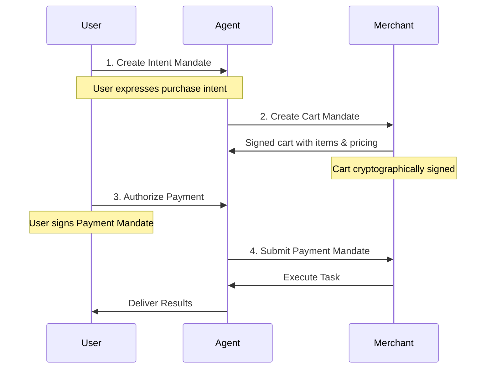

# Monetizable AI Agent with Google's AP2 Protocol

This is a **business consulting AI agent** that implements Google's **Agent Payments Protocol (AP2)** for secure, standardized payments.

## What is AP2?

The **Agent Payments Protocol (AP2)** is an open protocol developed by Google and 60+ partners (Mastercard, Visa, PayPal, Stripe, etc.) that enables AI agents to securely make payments on behalf of users.

### Key Features:
- **Verifiable Digital Credentials (VDCs)** - Cryptographically signed mandates
- **Three Mandate Types**:
  - **Intent Mandate**: User's purchase intent
  - **Cart Mandate**: Merchant's signed cart with items and pricing
  - **Payment Mandate**: User's payment authorization
- **Non-repudiable** - Cryptographic signatures create accountability
- **Interoperable** - Works across different AI agents and payment systems

## Architecture

```
User → Shopping Agent → Merchant Agent
                ↓
        1. Intent Mandate (user intent)
                ↓
        2. Cart Mandate (signed cart)
                ↓
        3. Payment Mandate (payment auth)
                ↓
        4. Task Execution
```

## Installation

### Prerequisites
- Python 3.10+
- Google API Key (for Gemini AI)

### Setup

1. **Install dependencies:**
```bash
pip install -r requirements_ap2.txt
```

2. **Set up environment variables:**
Create a `.env` file:
```
GOOGLE_API_KEY=your_google_api_key_here
```

3. **Run the agent:**
```bash
python agent_ap2.py
```

The agent will start on `http://localhost:8000`

## Usage

### Test the AP2 Flow

Run the test client to see the complete AP2 payment flow:

```bash
python test_ap2_client.py
```

This demonstrates:
1. Agent discovery
2. Creating an Intent Mandate
3. Creating a Cart Mandate
4. Processing payment with Payment Mandate
5. Task execution
6. Legacy flow (without AP2)

### Manual Testing

#### 1. Discover Agent Capabilities

```bash
curl http://localhost:8000/.well-known/agent.json
```

#### 2. Create Intent Mandate

```bash
curl -X POST http://localhost:8000/a2a \
  -H "Content-Type: application/json" \
  -d '{
    "jsonrpc": "2.0",
    "method": "createIntentMandate",
    "params": {
      "description": "I need business analysis for my startup",
      "skillId": "business-analysis"
    },
    "id": 1
  }'
```

#### 3. Create Cart Mandate

```bash
curl -X POST http://localhost:8000/a2a \
  -H "Content-Type: application/json" \
  -d '{
    "jsonrpc": "2.0",
    "method": "createCartMandate",
    "params": {
      "skillId": "business-analysis",
      "taskDescription": "Analyze market opportunity"
    },
    "id": 1
  }'
```

#### 4. Process Payment

```bash
curl -X POST http://localhost:8000/a2a \
  -H "Content-Type: application/json" \
  -d '{
    "jsonrpc": "2.0",
    "method": "processPayment",
    "params": {
      "cartId": "your-cart-id-here",
      "paymentMethod": {
        "method_name": "card",
        "payer_name": "John Doe",
        "payer_email": "john@example.com"
      },
      "userAuthorization": "USER_SIG_PLACEHOLDER"
    },
    "id": 1
  }'
```

## Available Services

| Service ID | Description | Price |
|------------|-------------|-------|
| `business-analysis` | Comprehensive business analysis | $50 |
| `market-research` | Market research and competitive analysis | $75 |
| `strategy-planning` | Strategic business planning | $100 |
| `quick-consult` | Quick consultation (15 min) | $25 |

## API Endpoints

### Agent Discovery
- `GET /.well-known/agent.json` - Agent card with capabilities

### A2A + AP2
- `POST /a2a` - Main JSON-RPC endpoint

#### Methods:
- `createIntentMandate` - Create user intent
- `createCartMandate` - Create signed cart
- `processPayment` - Authorize payment
- `submitTask` - Submit consulting task
- `getTaskStatus` - Check task status
- `sendMessage` - Continue conversation

### Utility
- `GET /` - Agent info
- `GET /health` - Health check
- `GET /mandates/{mandate_id}` - Retrieve mandate

## AP2 Payment Flow



## Mandate Types

### Intent Mandate
```json
{
  "user_cart_confirmation_required": true,
  "natural_language_description": "I need business analysis",
  "merchants": ["consulting-agent-merchant-001"],
  "skus": ["business-analysis"],
  "requires_refundability": true,
  "intent_expiry": "2025-10-01T12:00:00Z"
}
```

### Cart Mandate
```json
{
  "contents": {
    "id": "cart-uuid",
    "user_cart_confirmation_required": true,
    "payment_request": { /* W3C Payment Request */ },
    "cart_expiry": "2025-09-30T13:00:00Z",
    "merchant_name": "Business Consultant Agent (AP2)"
  },
  "merchant_authorization": "MERCHANT_SIG_xxx"
}
```

### Payment Mandate
```json
{
  "payment_mandate_contents": {
    "payment_mandate_id": "payment-uuid",
    "payment_details_id": "cart-uuid",
    "payment_details_total": { /* Payment total */ },
    "payment_response": { /* W3C Payment Response */ },
    "merchant_agent": "consulting-agent-merchant-001",
    "timestamp": "2025-09-30T12:30:00Z"
  },
  "user_authorization": "USER_SIG_xxx"
}
```

## Security Considerations

⚠️ **This is a demonstration implementation**

In production, you MUST implement:

1. **Cryptographic Signatures**
   - Replace placeholder signatures with real crypto (e.g., Ed25519)
   - Verify all mandate signatures
   - Use hardware security modules for key storage

2. **Payment Processing**
   - Integrate with real payment processor (Stripe, PayPal, etc.)
   - Implement 3D Secure for card payments
   - Handle payment failures and retries

3. **Authentication & Authorization**
   - Implement OAuth 2.0 or similar
   - Verify user identity before mandate creation
   - Rate limiting and fraud detection

4. **Data Storage**
   - Replace in-memory storage with secure database
   - Encrypt sensitive data at rest
   - Implement backup and recovery

5. **Compliance**
   - PCI DSS compliance for card data
   - GDPR/CCPA for user data
   - Transaction auditing and logging

## Resources

- **AP2 Specification**: https://ap2-protocol.org/
- **GitHub Repository**: https://github.com/google-agentic-commerce/AP2
- **Google Cloud Blog**: https://cloud.google.com/blog/products/ai-machine-learning/announcing-agents-to-payments-ap2-protocol
- **W3C Payment Request API**: https://www.w3.org/TR/payment-request/

## Comparison: Original vs AP2 Agent

| Feature | Original Agent | AP2 Agent |
|---------|---------------|-----------|
| Payment Protocol | Custom | AP2 (Standard) |
| Mandate Types | None | Intent, Cart, Payment |
| Cryptographic Proof | No | Yes |
| Interoperability | Limited | High |
| Payment Methods | Custom | Card, Bank, Crypto |
| Dispute Resolution | Manual | Cryptographic Evidence |
| Network Support | None | 60+ partners |

## License

MIT License

## Contributing

This is a demonstration implementation. For production use:
1. Implement proper cryptographic signatures
2. Integrate with real payment processors
3. Add comprehensive error handling
4. Implement security best practices
5. Add extensive testing

## Support

For questions about AP2:
- GitHub Discussions: https://github.com/google-agentic-commerce/AP2/discussions
- AP2 Documentation: https://ap2-protocol.org/

---

**Built with AP2 v0.1** 🚀
